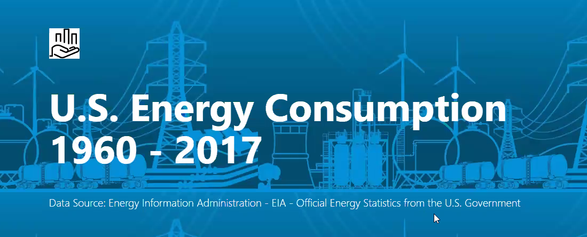
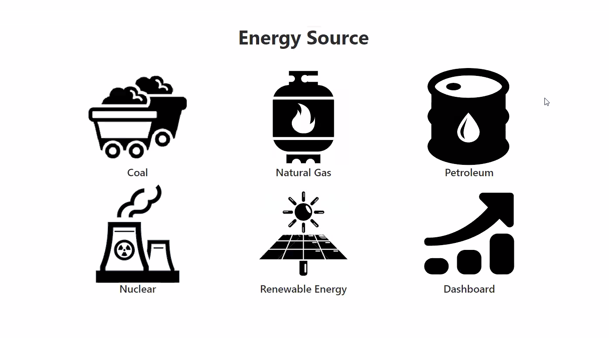
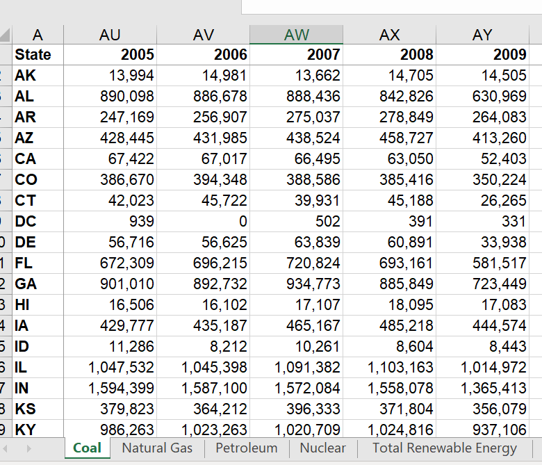
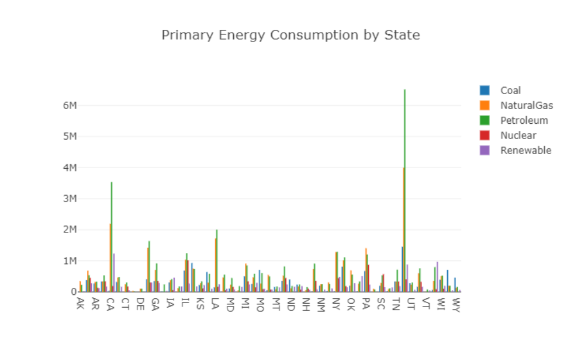
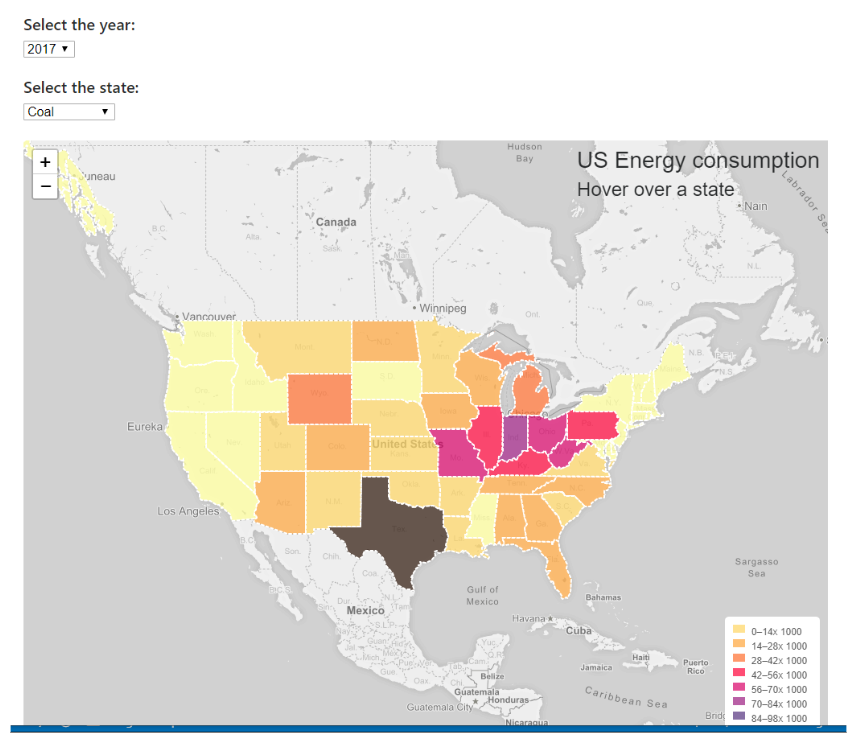
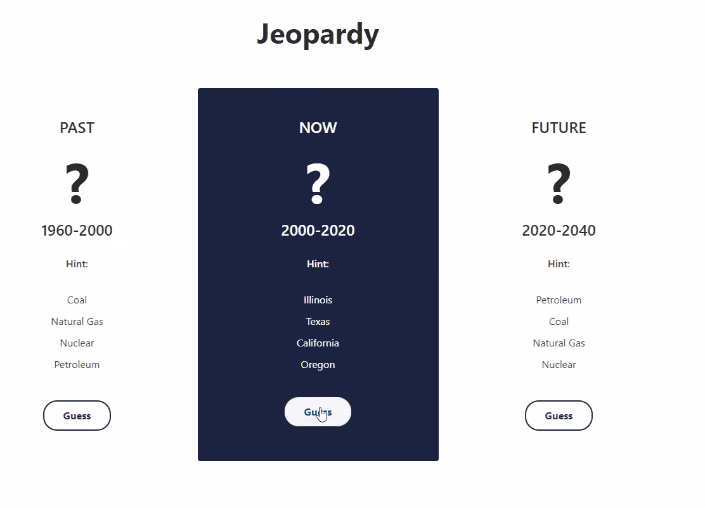

# Rice Energy - US Energy Consumption Research



As a data analytics team, we have compiled and analyzed data researching the different types of energy sources that have been used in the United States over the last 60 years. Through our research and analysis, we have uncovered several distinguishing trends and patterns in energy consumption that have emerged at the intersection of energy, technology, environmental changes, and population growth. 

We have created several powerful visualizations to help the energy industry recognize these trends and also predict how energy will be produced and consumed in the future. 

Our visualizations were created by using D3 - to retrieve and build data functions, Plotly - to create visuals such as the bar graphs and scatter plots, SQL - this was our database that we used to store our data, Python Flask - to connect our database and populate our visuals with data, and HTML/CSS to deploy our findings to a webpage.  
We used [chroma.js](https://vis4.net/chromajs/) to compute the map color scale. Additional information can be found in [GitHub](https://github.com/gka/chroma.js) 



##### Our dashboard on the main page of the webpage link to the five different energy sources used in the United States. 



Our data came from the U.S. Goverment statistics on Energy. This data range is from 1960 to 2017 and covers all fifty states for each year and their consumption rates of Nuclear, Petroleum, Renewable, Coal, Natural Gas. 



We have several plotly visuals that describe each energy source by state in 2017 as well for each energy source



Our map displays the energy consumption by each state and year with a color scheme that highlights each energy source. 



We have provided some fun facts in a question format to challenge our viewers on their knowledge of US Energy Consumption.
<br><br>
## Requirements
### Python
To run the app, you need to install flask and sqlAlchemy
<br>
### How to run
In terminal, <br>
``` conda activate PythonData``` <br>
then start the server by typing ```python app.py```<br>
Open the web browser and redirect to your server ```http://127.0.0.1:5000/```

### Heroku
A compiled version of the app can be found on [Heroku](https://www.heroku.com/home) at:


